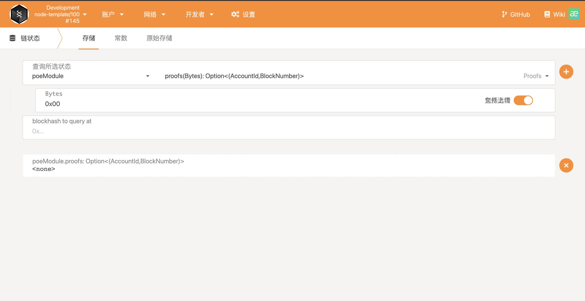
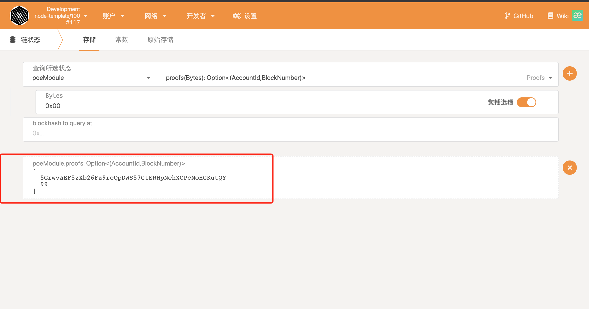
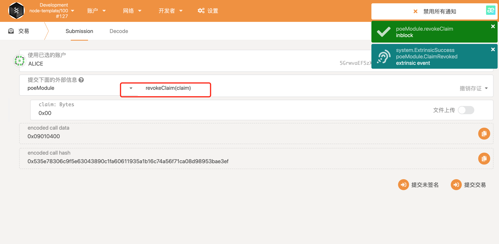
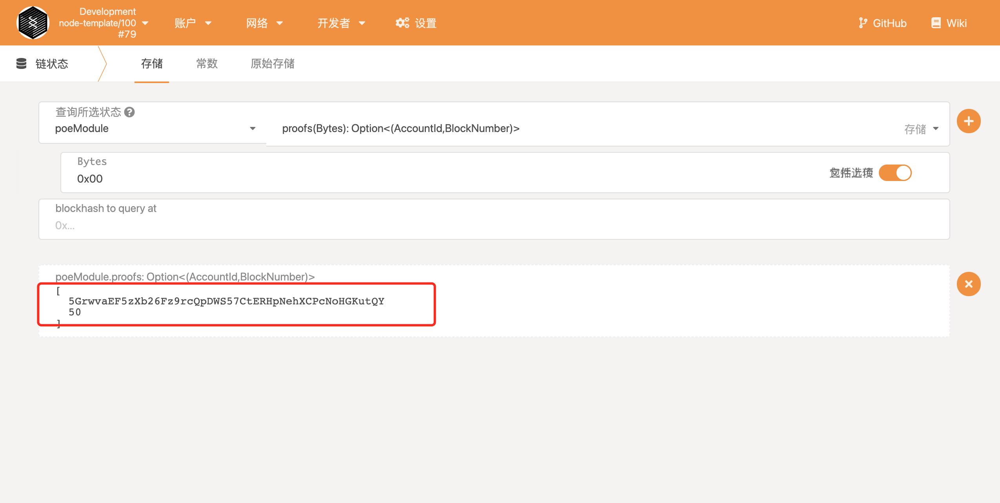
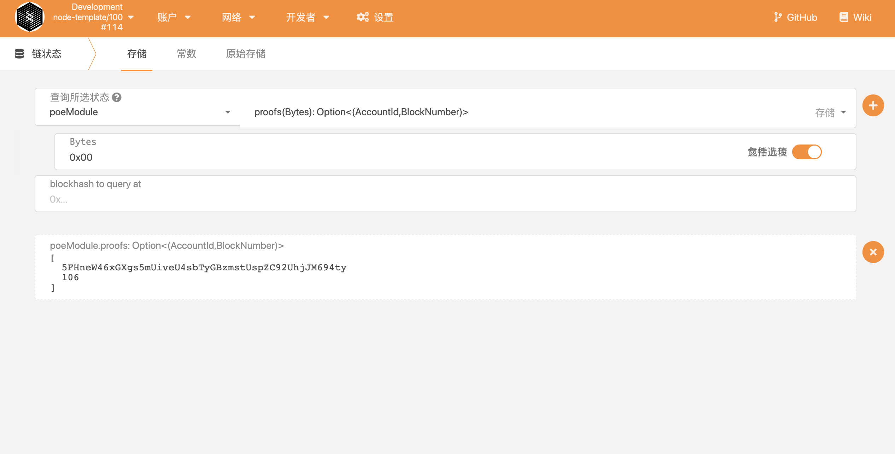

#  基于substrate实现的链上存证功能

##  1.创建存证

-  初始链状态中的存储对应的存证为none

  

-  创建存证，再次查看，存证上链

  
-  创建存证成功测试用例
   fn create_claim_works()
-  创建存证失败测试用例-存证已存在
   fn create_claim_failed_when_claim_already_exist()
-  创建存证失败测试用例-存证长度超出限制
   fn create_claim_failed_when_length_exceeded()

##  2.撤销存证

- 执行poe模块的revoke撤销函数，撤销存证

  

- 再次查看链上存储，发现为none，存证撤销成功

  
- 撤销存证成功用例
  fn revoke_claim_works()
- 撤销存证失败用例-存证不存在
  fn revoke_claim_failed_when_claim_not_exist()

##  3.转移存证

- 执行poe的transfer函数，转移存证

  
  
  

- 检查存证发现alice的存证已被转移到bob账户
  
  
  
- 转移存在成功测试用例
  fn transfer_claim_works()
- 转移存证失败测试用例-存证不存在
  fn transfer_claim_failed_when_claim_not_exist()
